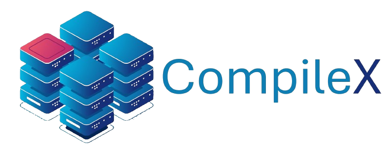

<div align="center"></div>
<div align="center"><b>Sanboxed Code Execution</b></div>
<br>

# CompileX  

Isolated code execution environment for multiple programming languages like Java, C++, and Python.  

---

## ✨ Features  

✅ **Sandboxed Execution**:  
Run code in a controlled environment using Docker to ensure safety and isolation. 🐳  

✅ **Multi-Language Support**:  
Supports **Java**, **C++**, and **Python** for versatile coding needs. 🚀  

✅ **REST API Integration**:  
Seamless execution through REST API endpoints. 🌐  

✅ **Time-Limit Enforcement**:  
Prevent infinite loops and misuse with strict execution time limits. ⏱️  

✅ **Detailed Output Reporting**:  
Get comprehensive feedback including:  

- **Program Output** 📝  
- **Error Logs** ⚠️  
- **Runtime Exceptions** 💥  

---

## 🛠️ How It Works  

1. **Submit Code**:  
   Use the REST API to send code, the language

2. **Sandbox Execution**:  
   The code is executed in a Docker container, isolated from the host system.  

3. **Get Results**:  
   Receive the program output, errors, or runtime exceptions in the response.  

---

## 📦 API Endpoints  

### `POST /api/execute`  

- **Description**: Execute code in the specified language.  
- **Request Body**:  

```json
{
    "language": "java | cpp | python",
    "code": "Your code here",
}
```  

- **Response**:

```json
{
    "message": "success",
    "data": {
        "exitCode": "0 or 1",
        "output": "program output here",
    }
}
```  

---

## 🛡️ Security  

- All code is executed in **isolated Docker containers**.  
- Time limits prevent long or infinite execution loops.  

---

## 🎯 Future Enhancements  

- Support for more languages (e.g., JavaScript) 🔄  
- Authentication for API access 🔒  

---

## 💡 Contributing  

Contributions are welcome! Feel free to fork the repo and submit a pull request. 🙌  
